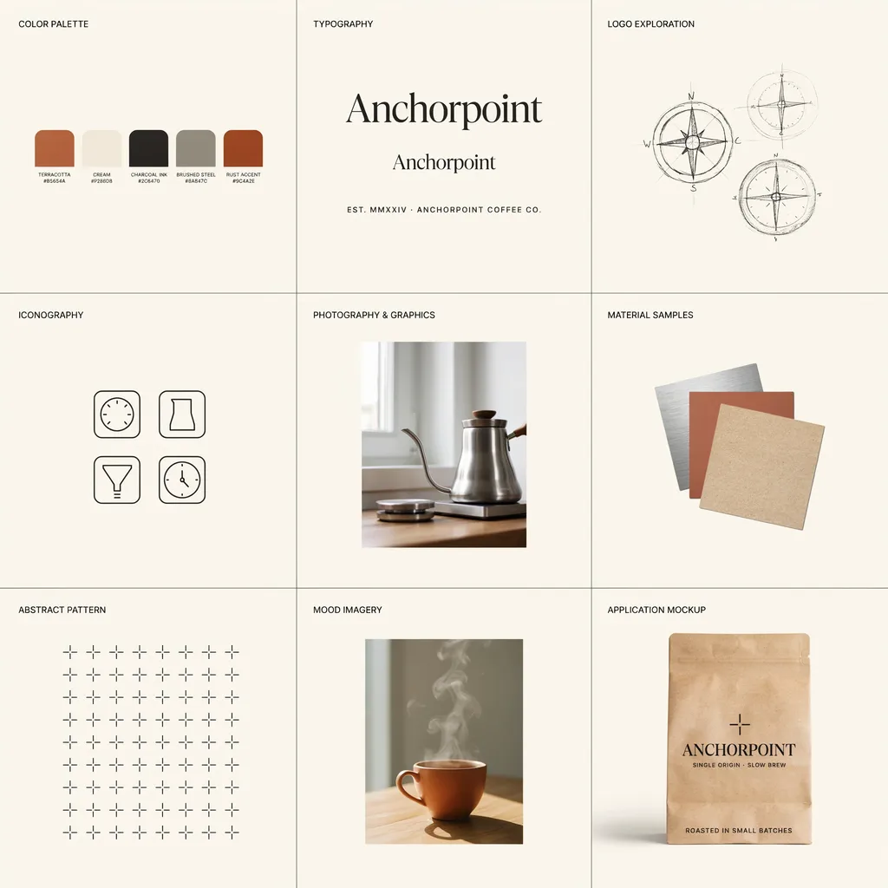
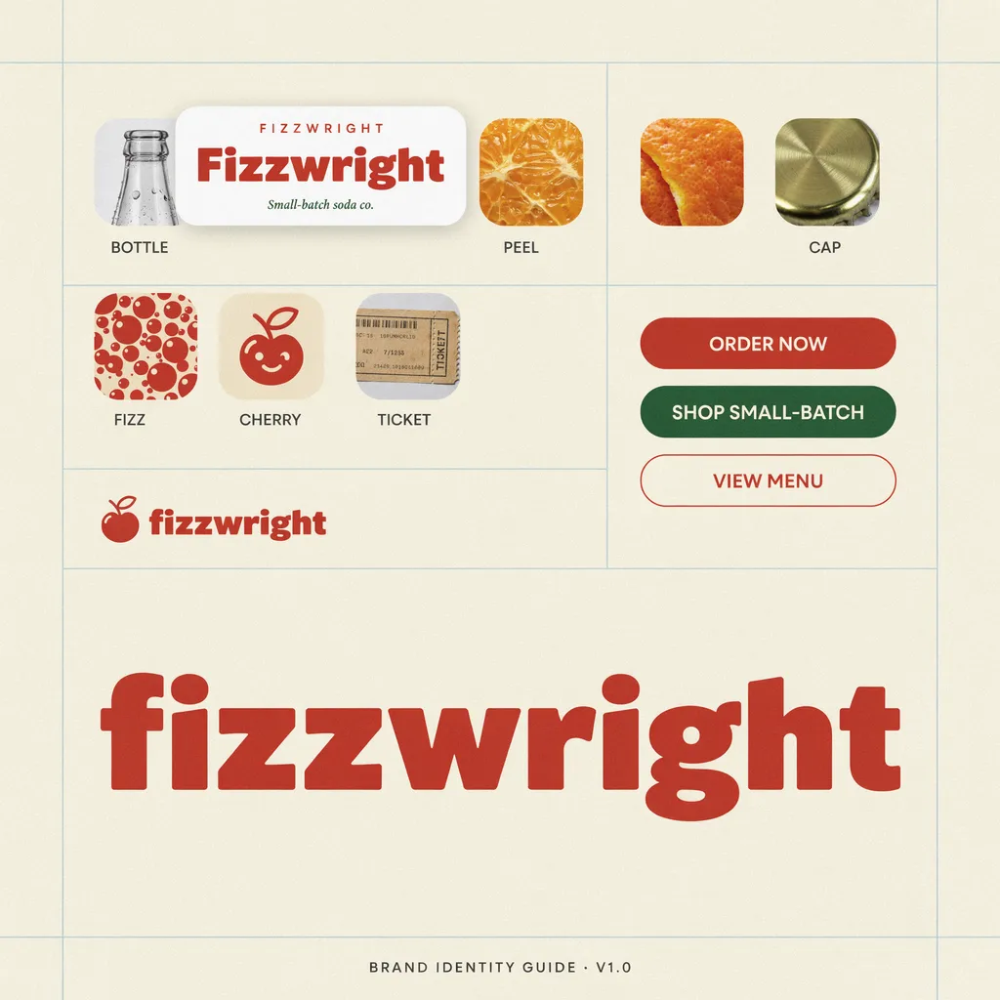
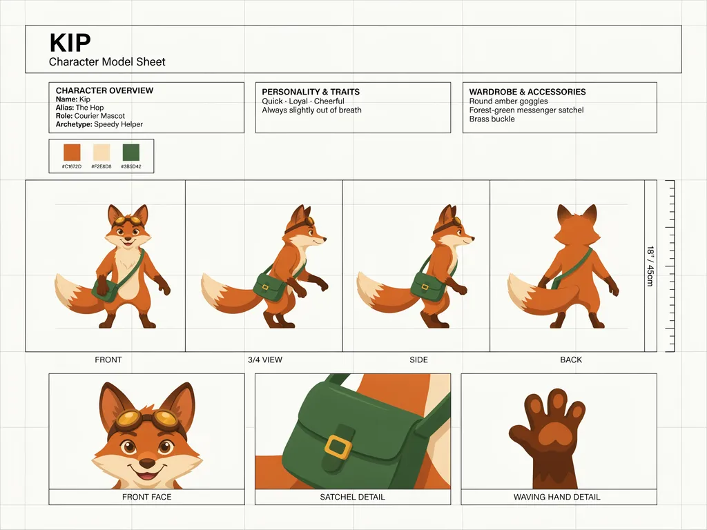

# ideogram-ai-toolkit

A set of Claude Code skills for [Ideogram AI](https://ideogram.ai) image generation — general prompting technique (loose vs. structured, color-palette control, reference-image style extraction, remix vs. edit), plus purpose-built skills for brand identity sheets and character model sheets. Built by [Devkind](https://devkind.com.au).

Ideogram 4 was trained on structured JSON captions, not plain text — this toolkit documents that schema (adapted from the official [ideogram-oss/ideogram4](https://github.com/ideogram-oss/ideogram4) docs, Apache-2.0) and packages practical prompting technique around it, scoped to what the connected Ideogram MCP (`generate_image`, `describe_image`, `remix_image`, `edit_image`) actually supports.

## What's in here

```
skills/ideogram-prompt/                   # general Ideogram prompting technique
├── SKILL.md
└── references/
    ├── json-caption-schema.md            # Ideogram 4's structured caption schema
    └── style-extraction-workflow.md      # describe → extract recipe → apply → generate loop
skills/logo-prompting/                    # logo/brand-mark prompt writing, Ideogram-first
├── SKILL.md
├── references/                           # anti-slop discipline, brand visual-layer reading, intake checklist
└── examples/                             # accumulated real logo-prompt directions by style family
skills/brand-identity-sheet/              # whole brand system in one generated image (wordmark, icons, buttons)
├── SKILL.md
├── references/                           # panel anatomy, composition-spec JSON schema, anti-slop discipline
├── examples/                             # a worked prompt + full JSON breakdown
└── evals/                                # eval scenarios for this skill
skills/character-model-sheet/             # multi-panel character turnaround sheet (mascot, game/animation character)
├── SKILL.md
├── references/                           # panel anatomy, composition-spec JSON schema, anti-slop discipline
├── examples/                             # a worked prompt + full JSON breakdown
└── evals/                                # eval scenarios for this skill
skills/moodboard-generator/                # pre-logo 3x3 brand-exploration board (loose adjectives, unlocked palette)
├── SKILL.md
├── references/                           # panel anatomy, composition-spec JSON schema, anti-slop discipline
└── examples/                             # a worked prompt + full JSON breakdown
examples/                                 # generated showcase assets + the exact prompts used
```

See [`examples/`](examples/README.md) for the full write-up — each image below links to its exact prompt.

<table>
  <tr>
    <td align="center" width="33%">
      <a href="examples/README.md#1-editorial-product-photo--precise-color_palette-control">
        <br>
        Editorial product photo
      </a>
    </td>
    <td align="center" width="33%">
      <a href="examples/README.md#2-vintage-sci-fi-poster--art_style--in-image-text-via-bounding-boxes">
        <br>
        Vintage sci-fi poster
      </a>
    </td>
    <td align="center" width="33%">
      <a href="examples/README.md#3-packaging-label--graphic_design-medium-with-multiple-text-elements">
        <br>
        Packaging label
      </a>
    </td>
  </tr>
  <tr>
    <td align="center" width="33%">
      <a href="examples/README.md#4-abstract-3d-icon--3d_render-medium">
        <br>
        Abstract 3D icon
      </a>
    </td>
    <td align="center" width="33%">
      <a href="examples/README.md#5-style-extraction--reference-image-to-new-subject">
        <br>
        Style extraction (reference)
      </a>
    </td>
    <td align="center" width="33%">
      <a href="examples/README.md#5-style-extraction--reference-image-to-new-subject">
        <br>
        Style extraction (applied)
      </a>
    </td>
  </tr>
  <tr>
    <td align="center" width="33%">
      <a href="examples/README.md#6-brand-identity-moodboard--33-panel-grid">
        <br>
        Brand identity moodboard
      </a>
    </td>
    <td align="center" width="33%">
      <a href="skills/brand-identity-sheet/examples/fizzwright-identity-sheet.md">
        <br>
        Brand identity sheet (Fizzwright)
      </a>
    </td>
    <td align="center" width="33%">
      <a href="skills/character-model-sheet/examples/kip-hopcarry-character-sheet.md">
        <br>
        Character model sheet (Kip)
      </a>
    </td>
  </tr>
</table>

## Install

This is a set of Claude Code [skills](https://docs.claude.com/en/docs/claude-code/skills). Requires the [Ideogram MCP](https://ideogram.ai/features/mcp/) to be connected (`claude mcp add ideogram --transport http https://mcp.ideogram.ai/mcp`).

Each skill installs independently — swap `ideogram-prompt` below for `logo-prompting`, `brand-identity-sheet`, or `character-model-sheet` as needed.

**Via the [skills CLI](https://www.skills.sh)** (reads straight from this GitHub repo, no unreviewed single-URL installer):
```bash
npx skills add https://github.com/devkindhq/ideogram-ai-toolkit/tree/main/skills/ideogram-prompt
# or, from a project root, target it explicitly:
npx skills add devkindhq/ideogram-ai-toolkit -s ideogram-prompt
```
Add `-g` to install globally (available in every session) instead of just the current project.

**Project-scoped, manual** (checked into a repo, shared with your team):
```bash
git clone https://github.com/devkindhq/ideogram-ai-toolkit.git /tmp/ideogram-ai-toolkit
cp -r /tmp/ideogram-ai-toolkit/skills/ideogram-prompt <your-project>/.claude/skills/ideogram-prompt
```

**Personal, manual** (available in every session):
```bash
git clone https://github.com/devkindhq/ideogram-ai-toolkit.git ~/ideogram-ai-toolkit
ln -s ~/ideogram-ai-toolkit/skills/ideogram-prompt ~/.claude/skills/ideogram-prompt
```

We deliberately don't ship a one-line `curl ... | skill.md` installer — pulling an unreviewed instruction file straight into `~/.claude/skills/` from a single URL is a real prompt-injection / supply-chain risk for an AI agent, and we'd rather you read the skill before trusting it. Clone it, read `SKILL.md`, then symlink or copy it in.

## Why this exists

Some public prompting guides for Ideogram reference a one-line curl installer for a Claude Code skill hosted at a single URL outside GitHub. That URL wasn't independently verifiable at the time this toolkit was built (returned HTTP 403, no cached or archived copy found), so this repo exists as an open, reviewable alternative: same underlying technique (documented against the real, open-source `ideogram-oss/ideogram4` schema and the actual Ideogram MCP tool surface), but as source you can read before you run it.

## License

Apache License 2.0 — see [LICENSE](LICENSE) and [NOTICE](NOTICE). The JSON caption schema reference is adapted from `ideogram-oss/ideogram4` (Apache-2.0).
