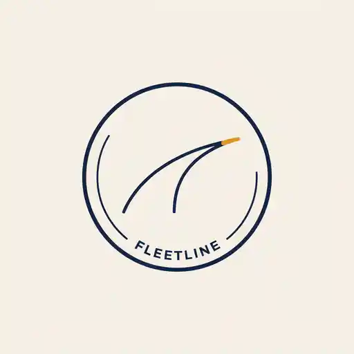
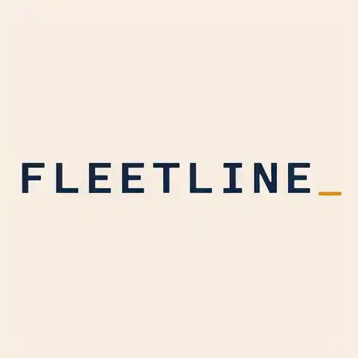

# Worked Example — Fleetline, Four Directions

| | | | |
|---|---|---|---|
|  |  |  |  |
| 1. Wordmark | 2. Badge / emblem | 3. Mark-only | 4. Monospace-as-identity |

A from-scratch fictional brand invented to demonstrate this skill's "structural
variety over palette-swaps" rule end to end: **Fleetline**, a voice-dispatch AI
product for trucking and logistics fleets, unrelated to any client or real product.
All four images were produced through the real workflow — each prompt below was
submitted to Ideogram (`generate_image`, `aspect_ratio: "1x1"`, `resolution:
"1024x1024"`, `rendering_speed: "QUALITY"`) exactly as written.

## The four inputs (gathered before writing any prompt)

1. **Brand truth** — Fleetline lets dispatchers run a fleet by voice instead of a
   screen: call in, get routed, never miss a load. The archetype is the reliable
   navigator, not a chatty consumer assistant — the brand promise is "always on,"
   not "fun to talk to."
2. **Visual layer** — Primary: deep indigo-navy `#1D2B4F` (dependable, always-on).
   Accent (reserved for exactly one live-indicator element per mark, never
   decorative elsewhere): amber `#E8A33D`. Base: warm paper-white `#F3EEE5`.
   Typography: a grounded geometric sans, tight optical spacing, roman-only for the
   wordmark direction; an uppercase monospace/typewriter-log face for the
   monospace direction. Reference objects: a highway lane reflector, a dispatcher's
   uniform patch, a printed dispatch log — not a literal truck, wheel, or headset.
3. **Intake context** — needs to survive as a small app icon and a favicon, so at
   least one direction (the mark-only icon) was written with an explicit 16px
   legibility constraint.
4. **Anti-slop guardrails** — see `references/anti-slop-discipline.md`: no
   gradients, no neural-network nodes, no glowing orb, no literal truck/wheel/
   headset icon, no purple-pink AI gradient.

## Why these are four directions, not one direction with a color picker

Per this skill's "structural variety over palette-swaps" rule, each direction below
has its own **form** and its own locked token set — not just a different accent:

| Direction | Form | What's structurally distinct about it |
|---|---|---|
| 1. Wordmark | Lowercase logotype, no icon | The identity is pure typography; the only accent is a single amber tick under the "i", styled as a radio-signal mark rather than a dot. |
| 2. Badge / emblem | Circular ring badge with arced type | Reads as a uniform patch, not a corporate seal — text follows the ring's curve, and the mark inside is a single continuous line, not a discrete icon. |
| 3. Mark-only | Icon with zero text | Built to work stripped of the wordmark entirely (favicon, app icon) — an abstract chevron-plus-tick form, tested against the 16px legibility constraint. |
| 4. Monospace-as-identity | All-caps monospace wordmark, no icon at all | The type *is* the mark — a typewriter/dispatch-log face standing in for "record-keeping, always-logging," with the amber accent repurposed as a live-feed cursor rather than a signal tick. |

## 1. Wordmark

```
Graphic design logo wordmark for "Fleetline", a voice-dispatch AI product for
trucking and logistics fleets. The word "Fleetline" set in a grounded geometric
sans-serif, tight optical spacing, lowercase, subtly rounded terminals, deep
indigo-navy (#1D2B4F) on a warm paper-white (#F3EEE5) background. A single short
amber (#E8A33D) horizontal dash sits beneath the dot of the "i", like a
radio-signal tick, the only accent color in the mark. No icon, no illustration,
just clean typography. Mood: an always-on dispatcher's reliability, night-shift
dependable, analog-radio warmth rather than glossy tech sheen. No gradients, no
neural-network nodes, no glowing orb, no soundwave bars, no truck or wheel icon.
Flat vector logo on solid background, centered composition.
```

## 2. Badge / emblem

```
Graphic design circular badge logo for "Fleetline", a voice-dispatch AI product
for trucking fleets. A navy (#1D2B4F) ring badge on warm paper-white (#F3EEE5)
background, containing one continuous abstract line inside the circle suggesting
a highway lane reflector arcing across the badge, the line's single tip rendered
in amber (#E8A33D) as the only accent. Small arced uppercase wordmark "FLEETLINE"
follows the badge's inner rim in a grounded geometric sans. Feels like a
dispatcher's uniform patch, not a corporate seal. No gradients, no neural-network
nodes, no glowing orb, no literal truck or wheel icon, no headset icon. Flat
vector emblem, centered composition.
```

## 3. Mark-only

```
Graphic design abstract icon-only logo mark for "Fleetline", a voice-dispatch AI
product, no text anywhere. Two simple overlapping geometric forms: a rounded
directional chevron shape crossed by one short diagonal tick line suggesting a
radio signal, rendered as a single flat navy (#1D2B4F) shape on a warm paper-white
(#F3EEE5) background. Simple enough to read clearly at a 16-pixel favicon size.
No gradients, no neural-network nodes, no glowing orb, no literal truck, wheel,
or headset icon, no soundwave bars. Flat vector icon, centered composition,
generous padding.
```

## 4. Monospace-as-identity

```
Graphic design monospace typographic logo for "Fleetline", a voice-dispatch AI
product. The full word "FLEETLINE" set entirely in an uppercase monospace
typewriter-dispatch-log typeface, wide letter tracking, deep indigo-navy
(#1D2B4F) on warm paper-white (#F3EEE5) background. A single amber (#E8A33D)
monospace underscore cursor character sits immediately after the wordmark,
suggesting an active live feed or ticker. No icon, no illustration, no logo
mark, the typography itself is the entire identity, feels like a printed
dispatch log or teletype record. No gradients, no neural-network nodes, no
glowing orb. Flat vector typography, centered composition, solid background.
```

## What to reuse from this example

- The pattern of **naming one accent color's exact role per direction** (a signal
  tick, a badge-line tip, a live cursor) rather than reusing it identically —
  the accent stays locked to the palette but its *meaning* changes per form.
- Writing the anti-slop exclusion list at the end of every prompt, even when the
  direction feels unlikely to drift toward a cliché (a monospace wordmark has
  little gradient risk, but the same closing clause costs nothing and stays
  consistent across all four).
- Using a real-world reference object (highway reflector, dispatch log, radio
  tick) instead of an adjective for the "feeling" — none of these four prompts
  say "modern" or "reliable" as a bare adjective.
