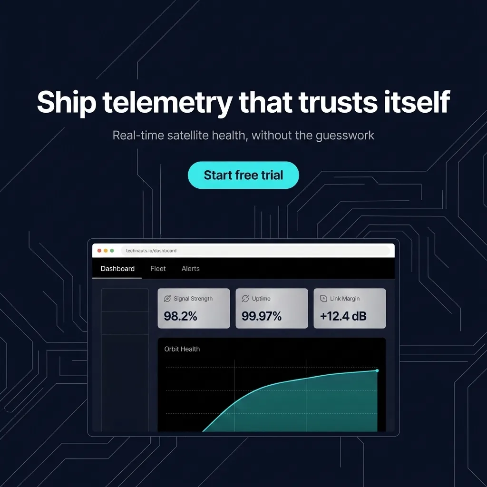

# Worked Example: Technauts Landing-Page Hero

A real, end-to-end run of workflow steps 1-6 and 8 for the landing-page hero format,
using the fictional "Technauts" brand and the same headline/subhead/CTA/nav copy as
`references/composition-spec-format.md`'s worked example, so the two files describe
the same composition consistently. Palette (deep space navy, electric cyan, metallic
silver) reused from `brand-identity-sheet/examples/technauts-identity-sheet.md` for
cross-skill consistency rather than inventing a new palette for the same fictional
brand.

## Compositional layer assignment (workflow step 2)

- **Background/Environment** — deep space-navy, faint diagonal blueprint grid line
  pattern.
- **Nav Bar** — real labels inside the browser frame: "Dashboard", "Fleet", "Alerts".
- **Hero Copy Zone** — headline "Ship telemetry that trusts itself", subheadline
  "Real-time satellite health, without the guesswork".
- **CTA Placement** — "Start free trial", electric-cyan pill button, directly below
  the subheadline.
- **Device Frame/Chrome** — browser-chrome window frame (address bar, three
  window-control dots) containing the product visual.
- **Product Visual** — satellite-telemetry dashboard: sidebar, stat cards, an "Orbit
  Health" line chart.

## 1. The paragraph prompt

> A landing-page hero marketing image for the tech brand Technauts, laid out as a
> full-bleed web hero on a deep space-navy background with a faint diagonal blueprint
> grid line pattern. Centered near the top, a large bold white sans-serif headline
> reads "Ship telemetry that trusts itself", with a smaller warm-gray subheadline
> directly below reading "Real-time satellite health, without the guesswork". Below
> the subheadline, an electric-cyan pill-shaped CTA button reads "Start free trial" in
> bold dark-navy text. Beneath the CTA, a browser-chrome window frame (light-gray
> address bar, three small window-control dots) contains a satellite-telemetry
> dashboard product screen: a slim nav bar inside the browser reads "Dashboard",
> "Fleet", "Alerts" in light-gray sans-serif labels; the dashboard itself shows a
> dark-navy sidebar, three metallic-silver stat cards with signal-strength
> percentages, and a cyan line chart labeled "Orbit Health" trending upward across the
> panel. Sharp geometric letterforms throughout, clean sans-serif typography, no
> neural-network nodes, no glowing orb as a hero icon, no purple-to-pink gradient
> wash, no stock-photo textures, no placeholder nav labels.

**What this prompt does right (per `SKILL.md` step 3's discipline):** every
text-bearing element carries its literal copy in quotes rather than a vague
description ("a headline" would have let Ideogram invent filler); the stat cards and
chart are described by role (signal-strength percentages, an upward trend) without
inventing exact numbers the model would have to render as arbitrary digits; the
negative-space clause names the specific banned patterns (neural-network nodes,
glowing orb, purple-to-pink gradient, stock-photo textures, placeholder nav labels)
rather than a vague "keep it professional."

## Anti-slop gate scoring (workflow step 4, `references/anti-slop-discipline.md`)

| Axis | Score | Why |
|---|---|---|
| Copy completeness | 5 | Headline, subhead, CTA, and all three nav labels are real, literal, quoted copy. |
| Chart/data specificity | 4 | "Orbit Health" line chart trending upward, tied to a real telemetry metric; trend direction stated, though no explicit start/end values (acceptable — this is a hero shot, not the dashboard-screenshot format that demands full stat-card precision, see Task 7). |
| Universal-ban sweep | 5 | Prompt explicitly negates neural-network nodes, glowing-orb hero icon, purple-to-pink gradient, stock-photo textures, and placeholder nav labels. |
| Screen content legibility | 4 | Nav labels, stat-card subject (signal strength), and chart label are all specific enough to render as legible text, not decorative filler. |
| Layer completeness | 5 | All six layers from the assignment above are named in reading order: Background, Nav Bar, Hero Copy Zone, CTA Placement, Device Frame/Chrome, Product Visual. |

All axes score 3 or above — proceeded to generation without revision.

## Generation (workflow step 5)

Called `mcp__ideogram__generate_image` with the prompt above, `style_type: "DESIGN"`,
`rendering_speed: "QUALITY"`, `aspect_ratio: "16x9"`.

- **Request ID:** `XdRDYlh0RWuHmrvDelkZpw`
- **Response ID:** `rHCLRUpuV8yJinX6CeSyMA`
- **Image URL:** https://ideogram.ai/assets/image/balanced/response/rHCLRUpuV8yJinX6CeSyMA@2k
- **Permalink:** https://ideogram.ai/g/XdRDYlh0RWuHmrvDelkZpw/0
- **Downloaded to:** `examples/images/technauts-landing-hero.webp` (real file, 1024x576 WebP, confirmed via `file`)


The result renders every planned text element legibly: headline, subheadline, "Start
free trial" CTA, the browser address bar ("technauts.io/dashboard" — a plausible
in-world detail Ideogram added on top of the specified copy), "Dashboard / Fleet /
Alerts" nav, three stat cards ("Signal Strength 98.2%", "Uptime 99.97%", "Link Margin
+12.4 dB"), and an "Orbit Health" chart with an upward-trending line — all specific,
legible, and consistent with the prompt's intent.

## 2. The compositional deconstruction

Bbox values are estimated on a normalized 0-1000 grid (image is downscaled/estimated
by eye, not measured from source pixel coordinates — coarse-but-honest per
`references/composition-spec-format.md`'s guidance).

```json
{
  "high_level_description": "A landing-page hero image for Technauts showing a browser-chrome mockup of a satellite telemetry dashboard, with a headline, subheadline, and CTA button above it, on a deep-navy blueprint-grid background.",
  "compositional_deconstruction": {
    "background": "A deep space-navy background with a faint diagonal grid line pattern, evoking a technical blueprint aesthetic.",
    "elements": [
      {
        "type": "text",
        "bbox": [160, 150, 840, 240],
        "text": "Ship telemetry that trusts itself",
        "desc": "Hero Copy Zone — large bold white sans-serif headline, centered, tight letter-spacing, the dominant text element in the composition."
      },
      {
        "type": "text",
        "bbox": [300, 270, 700, 320],
        "text": "Real-time satellite health, without the guesswork",
        "desc": "Hero Copy Zone — subheadline directly below the headline, smaller weight, warm-gray color, centered."
      },
      {
        "type": "obj",
        "bbox": [420, 360, 580, 420],
        "desc": "CTA Placement — an electric-cyan pill-shaped button directly below the subheadline, containing the label 'Start free trial' in bold dark-navy text."
      },
      {
        "type": "obj",
        "bbox": [250, 520, 750, 1000],
        "desc": "Device Frame/Chrome — a browser-chrome window frame (light-gray address bar reading 'technauts.io/dashboard', three window-control dots) containing the Product Visual, cropped at the bottom edge of the 16:9 frame."
      },
      {
        "type": "obj",
        "bbox": [250, 580, 750, 630],
        "desc": "Nav Bar — a slim horizontal bar inside the browser frame with three real nav-item labels: 'Dashboard', 'Fleet', 'Alerts', in light-gray sans-serif text on a near-black bar."
      },
      {
        "type": "obj",
        "bbox": [250, 630, 750, 1000],
        "desc": "Product Visual — a satellite-telemetry dashboard screen with a dark sidebar, three metallic-silver stat cards ('Signal Strength 98.2%', 'Uptime 99.97%', 'Link Margin +12.4 dB'), and a line chart labeled 'Orbit Health' trending upward in cyan/teal."
      }
    ]
  }
}
```

## 3. The reframe variant

Called `mcp__ideogram__reframe_image` with `image_response_id: "rHCLRUpuV8yJinX6CeSyMA"`
and `aspect_ratio: "1x1"` to produce the social-square variant.

- **Request ID:** `jGsz3qCaTkCm7L9I2Xn0ew`
- **Response ID:** `kLAE5kuIXSOFybiysScRWQ`
- **Image URL:** https://ideogram.ai/assets/image/balanced/response/kLAE5kuIXSOFybiysScRWQ@2k
- **Permalink:** https://ideogram.ai/g/jGsz3qCaTkCm7L9I2Xn0ew/0
- **Downloaded to:** `examples/images/technauts-landing-hero-social-1x1.webp` (real file, 1024x1024 WebP, confirmed via `file`)



**Why the crop-risk check (workflow step 6) passed for this composition:** going from
16:9 to 1:1 makes the canvas *taller*, not narrower — per the bbox values above, the
Hero Copy Zone (`y: 150-320`) and CTA Placement (`y: 360-420`) sit in the horizontal
center with wide margins on both left and right edges (`x: 160-840` and `420-580`
respectively, well inside the 0-1000 frame), so a taller canvas has no horizontal
content to clip. The reframe outpainted additional background above and around the
existing composition rather than cropping into it — visible in the result as extended
blueprint-grid line decoration around the original content, with every text element
and the full device frame still intact and legible. A reframe to a *narrower* ratio
(e.g. 9:16) would need this same bbox check re-run, since it would tighten the
horizontal frame rather than extend the vertical one.
