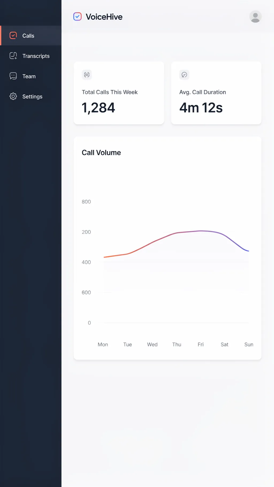

# Worked Example: VoiceHive Dashboard Screenshot

A real, end-to-end run of workflow steps 1-5 and 8 for the dashboard-screenshot
format, using the fictional "VoiceHive" brand, per the spec's Testing item 3: "the
VoiceHive dashboard — sidebar nav, a couple of stat cards, a call-volume chart." This
example's specific job is to prove the anti-slop gate's chart/data-specificity and
screen-content-legibility axes actually catch and correct a meaningless-chart draft
before generation, not just describe the mechanism in the abstract.

## Compositional layer assignment (workflow step 2)

- **Nav Bar/Sidebar** — real labels: "Calls", "Transcripts", "Team", "Settings".
- **Supporting UI Chrome** — two stat cards ("Total Calls This Week: 1,284" and
  "Avg. Call Duration: 4m 12s") plus a line chart labeled "Call Volume" trending with
  a visible weekday-by-weekday shape.
- **Background/Environment** — the app's own light-gray canvas background.

Per `mockup-anatomy.md`, this format has **no Device Frame/Chrome, no
environmental-context layer, and no CTA Placement layer** — confirmed: the screen
fills the frame, and no button in the layer assignment above is treated as a
singular hero CTA.

## The anti-slop gate catch

**First draft (would score under 3 on "Chart/data specificity"):**

> A dashboard screenshot for VoiceHive showing a sidebar with some navigation icons, a
> couple of stat cards, and a chart showing call volume.

This first draft fails the anti-slop gate: "some navigation icons" has no real labels
(fails "Chart/data specificity" and risks the "Decorative sidebar icons implying
navigation that goes nowhere" universal ban), "a couple of stat cards" names no real
metric or value, and "a chart showing call volume" names no axis labels, no data
trend, and no time range — exactly the "meaningless chart" failure mode
`anti-slop-discipline.md` bans. Scored against the pre-generation gate:

| Axis | Score (first draft) | Why |
|---|---|---|
| Copy completeness | 1 | No real nav labels, no real stat-card text. |
| Chart/data specificity | 1 | "A chart showing call volume" names no metric value, no axis labels, no trend. |
| Universal-ban sweep | 2 | "Some navigation icons" risks the decorative-sidebar-going-nowhere ban directly. |
| Screen content legibility | 2 | Nothing on-screen is specific enough to render as legible content. |
| Layer completeness | 3 | All three layers are at least gestured at (sidebar, cards, chart), even though none is specified. |

Two axes score under 3 — this draft is blocked from generation per the gate's rule
and must be revised.

**Revised draft (used for generation):**

> A polished dashboard screenshot for the voice-AI product VoiceHive, portrait
> orientation, light-gray app canvas background. A left sidebar (dark navy) lists four
> real navigation labels stacked vertically: "Calls", "Transcripts", "Team",
> "Settings", with the "Calls" item highlighted as active. To the right of the
> sidebar, two white stat cards sit side by side near the top: one reads "Total Calls
> This Week" with the large value "1,284" beneath it, the other reads "Avg. Call
> Duration" with the large value "4m 12s" beneath it. Below the stat cards, a
> full-width white card contains a line chart labeled "Call Volume" with a visible
> Y-axis scale and seven labeled weekday ticks (Mon through Sun) along the X-axis, the
> line rising through the week and dipping on the weekend. Clean sans-serif
> typography throughout, generous white space, no neural-network nodes, no glowing
> orb, no purple-to-pink gradient wash, no decorative icon-only nav items without
> labels.

## Anti-slop gate scoring — revised draft (workflow step 4)

| Axis | Score | Why |
|---|---|---|
| Copy completeness | 5 | All four nav labels, both stat-card labels/values, and the chart label are real, literal, quoted copy. |
| Chart/data specificity | 5 | "Call Volume" chart names a real metric with a visible Y-axis scale, seven labeled weekday ticks, and an explicit trend shape (rising through the week, dipping on the weekend). |
| Universal-ban sweep | 5 | Prompt explicitly negates neural-network nodes, glowing orb, purple-to-pink gradient wash, and decorative icon-only nav items. |
| Screen content legibility | 5 | Every stat card and chart element is described with real, renderable text and structure. |
| Layer completeness | 5 | All three layers from the assignment above are named: Nav Bar/Sidebar, Supporting UI Chrome (cards + chart), Background/Environment. |

All axes score 3 or above on the revised draft — proceeded to generation.

## 1. The paragraph prompt

The revised draft above (quoted again for the standard section location this skill's
other examples use):

> A polished dashboard screenshot for the voice-AI product VoiceHive, portrait
> orientation, light-gray app canvas background. A left sidebar (dark navy) lists four
> real navigation labels stacked vertically: "Calls", "Transcripts", "Team",
> "Settings", with the "Calls" item highlighted as active. To the right of the
> sidebar, two white stat cards sit side by side near the top: one reads "Total Calls
> This Week" with the large value "1,284" beneath it, the other reads "Avg. Call
> Duration" with the large value "4m 12s" beneath it. Below the stat cards, a
> full-width white card contains a line chart labeled "Call Volume" with a visible
> Y-axis scale and seven labeled weekday ticks (Mon through Sun) along the X-axis, the
> line rising through the week and dipping on the weekend. Clean sans-serif
> typography throughout, generous white space, no neural-network nodes, no glowing
> orb, no purple-to-pink gradient wash, no decorative icon-only nav items without
> labels.

## Generation (workflow step 5)

Called `mcp__ideogram__generate_image` with the revised prompt, `style_type:
"DESIGN"`, `rendering_speed: "QUALITY"`, `aspect_ratio: "9x16"` (an
App-Store-portrait-friendly ratio, per the spec's Testing item 3 naming "App Store
screenshot").

- **Request ID:** `UYoizSk2TW69ZCB7dLeKjA`
- **Response ID:** `cYCNT-n_V4CBqml1NLHArA`
- **Image URL:** https://ideogram.ai/assets/image/balanced/response/cYCNT-n_V4CBqml1NLHArA@2k
- **Permalink:** https://ideogram.ai/g/UYoizSk2TW69ZCB7dLeKjA/0
- **Downloaded to:** `examples/images/voicehive-dashboard-screenshot.webp` (real file, 1024x1820 WebP, confirmed via `file`)



The result renders every planned element legibly: "VoiceHive" header, sidebar nav
("Calls" active, "Transcripts", "Team", "Settings"), both stat cards with their exact
labels and values ("Total Calls This Week 1,284", "Avg. Call Duration 4m 12s"), and a
"Call Volume" chart with weekday ticks Mon-Sun and a line rising through midweek and
dipping toward the weekend — proving the revised prompt's specificity translated into
a legible, non-generic result.

**Honest note on a minor rendering artifact:** the chart's Y-axis numeric labels
render as legible digits (800, 200, 400, 600, 0) but in a non-monotonic top-to-bottom
order rather than a strictly descending 800/600/400/200/0 scale. This is a real
defect worth flagging rather than glossing over — the axis labels are individually
legible and specific (satisfying "Chart/data specificity" and "Screen content
legibility"), but their ordering is not scale-correct. This is the kind of
smaller-severity defect this skill's `SKILL.md` Error handling section addresses via
a targeted `edit_image` fix; it was not fixed here so this example can document the
gate's catch mechanism (the axis has real, legible values, which is what the gate
checks for) alongside an honest account of a residual generation-quality issue the
gate does not claim to guarantee away.

## 2. The compositional deconstruction

Bbox values are estimated on a normalized 0-1000 grid (image is downscaled/estimated
by eye, not measured from source pixel coordinates — coarse-but-honest per
`references/composition-spec-format.md`'s guidance).

```json
{
  "high_level_description": "A dashboard screenshot for VoiceHive showing a dark sidebar with four nav labels, two stat cards, and a 'Call Volume' line chart with weekday ticks, on a light-gray canvas.",
  "compositional_deconstruction": {
    "background": "A light-gray app canvas background, portrait orientation.",
    "elements": [
      {
        "type": "obj",
        "bbox": [0, 0, 220, 1000],
        "desc": "Nav Bar/Sidebar — a dark-navy vertical sidebar spanning the full height of the screen, with a 'VoiceHive' wordmark and logo mark at the top of the main canvas beside it."
      },
      {
        "type": "text",
        "bbox": [30, 100, 200, 360],
        "text": "Calls / Transcripts / Team / Settings",
        "desc": "Nav Bar/Sidebar — four stacked nav-item labels with icons, 'Calls' highlighted with an active-state accent bar and icon color."
      },
      {
        "type": "text",
        "bbox": [270, 130, 590, 240],
        "text": "Total Calls This Week — 1,284",
        "desc": "Supporting UI Chrome — a white stat card with a small icon, a gray label line, and a large bold value beneath it."
      },
      {
        "type": "text",
        "bbox": [620, 130, 950, 240],
        "text": "Avg. Call Duration — 4m 12s",
        "desc": "Supporting UI Chrome — a second white stat card, same treatment as the first, positioned to its right."
      },
      {
        "type": "obj",
        "bbox": [270, 280, 950, 660],
        "desc": "Supporting UI Chrome — a full-width white card titled 'Call Volume' containing a line chart with a visible numeric Y-axis and seven weekday ticks (Mon-Sun) on the X-axis, the line rising through midweek and dipping toward the weekend."
      }
    ]
  }
}
```
